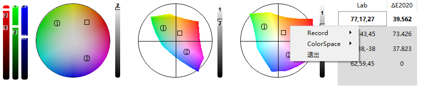

"# HoverColor" 

# HoverColor

example

## Usage

* pixel hover color : ctrl + `
* custom hover color : shift + `
* hover range : 
    up : ctrl + 1
    down : ctrl + 2
    reset : ctrl + 0

## update log
- 20250725:
  - adaptive resolution and size
- 20250719:
  - add BT2020 BT09 gamut
  - TODO : JCH support different gamut
  - add XYZ color space and [xy chromaticity diagram](https://github.com/ZhaJiMan/do_color)
- 20250717:
  - fix bug: RGB value display error: G=Gray : fixed
  - add new gamut ( only work on Lab colorspace): P3-D65(displayP3), sRGB, P3-DCI
  - remember last used profile, auto load last profile
  - **TODO : Reset profile**
- 20250717:
  - global hotkey setting
  - fix delta2020 -> 2000
  - **TODO : add some restricts for key binding**
- 20250715:
  - support : AutoAdjust Scaling when screen resolution changes
  - fix bug : multi screen crash : move from one screen to another
  - support : minimize and restore widget
- 20250712：
  - adjust colorwidget angle : red is on top-right
  - add [deltaE(2000)](https://github.com/lovro-i/CIEDE2000/blob/master/ciede2000.py)
  - add RGB+G record
  - **TODO : icc profile**
  - **TODO :more deltaE formula**
- 20250710:
    - add custom [screenashot](https://github.com/SeptemberHX/screenshot) color picker (average) : shift + `
    - add custom hover color picker size(average) : 
      - zoon in : ctrl + 1
      - zoon out : ctrl + 2
      - reset : ctrl + 0
    - widget layout adapted to widgets number
    - colorspace menuitems are moved to subfolder
- 20250410:
    - add custom hover color picker (point) : ctrl + `
    - show or hide any colorspace widget
    - switch to different color value recoder
    - 
