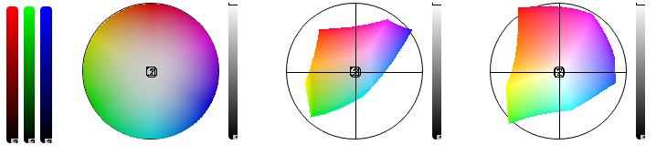

"# HoverColor" 

# HoverColor

example

## Usage

* pixel hover color : ctrl + `
* custom hover color : ctrl + 1
* hover range : 
    up : ctrl + 1
    down : ctrl + 2
    reset : ctrl + 0

## fork
pyqt_screenshot forked from pyqt_screenshot